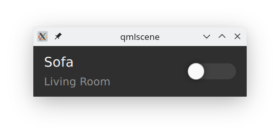

.. _appui:

App UI
======

The user interface of the Knut app is written in QML. Each item is designed in
such a way, that it can be viewed using ``qmlscene``. Data models that might be
provided by the :ref:`applogic` are mocked by dummy models in the
`qml/dummydata` directory.

For example, to view the :cpp:class:`LightControl` item, you would run from the
`qml` directory::

   qmlscene lights/LightControl.qml -I imports/

The UI elements are split mainly in two parts:

1. Control elements like switches, slider etc. or other generic items that can
   be used in any item (defined in `knut`).
2. Service specific items like the :cpp:class:`LightControl` from the example
   above that use generic control elements but have a functionality clearly for
   one service (defined in directories with the service name e.g. `light`).

However, each item must (if needed) get its design properties like colors or
font styles from the ``Theme`` module to guarantee that the app can be easily
customized.

.. toctree::
   :maxdepth: 2
   :caption: Item Documentation

   reference/ui/knut
   reference/ui/light
