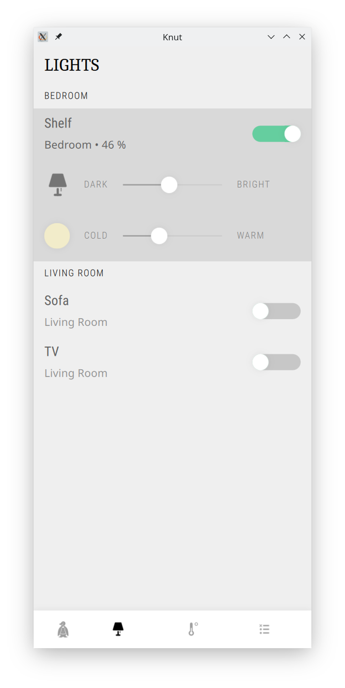

.. Knut App documentation master file.
   You can adapt this file completely to your liking, but it should at least
   contain the root `toctree` directive.

Welcome to Knut's App Documentation!
====================================

Knut is a friendly penguin to help organize your home. This project provides an
app to provide an user interface to the `Knut server
<https://github.com/pearjo/knut-server>`_.

.. toctree::
   :maxdepth: 2
   :caption: Contents

   gettingstarted
   applogic
   appui

Indices and tables
==================

* :ref:`genindex`
* :ref:`modindex`
* :ref:`search`
