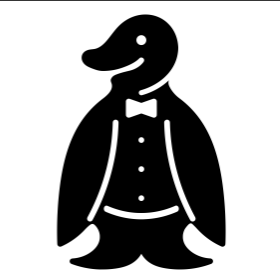
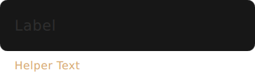

.. _knutui:

Knut Items
==========

.. doxygenclass:: AnimatedIconButton
   :project: knut-app
   :members:

As an example of the :cpp:class:`AnimatedIconButton`, with the Knut icon as top
and the close icon as bottom icon:

.. code-block:: qml
   :linenos:

   AnimatedIconButton {
       bottomSource: "close.svg"
       color: "black"
       iconSize: 24
       topSource: "knut.svg"
   }

.. doxygenclass:: ColorIcon
   :project: knut-app
   :members:

.. doxygenclass:: Divider
   :project: knut-app
   :members:

.. doxygenclass:: ListViewHeader
   :project: knut-app
   :members:

.. doxygenclass:: TextInput
   :project: knut-app
   :members:

.. code-block:: qml
   :linenos:

   TextInput {
       helperText: qsTr("Helper Text")
       lable: qsTr("Label")
   }

.. doxygenclass:: TopBar
   :project: knut-app
   :members:

.. doxygenclass:: TriSwitch
   :project: knut-app
   :members:

TriSwitch with a value set to 0.5:

.. code-block:: qml
   :linenos:

   TriSwitch { value: 0.5 }

